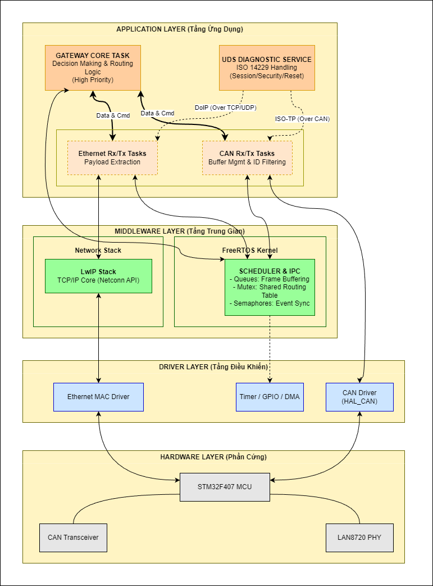
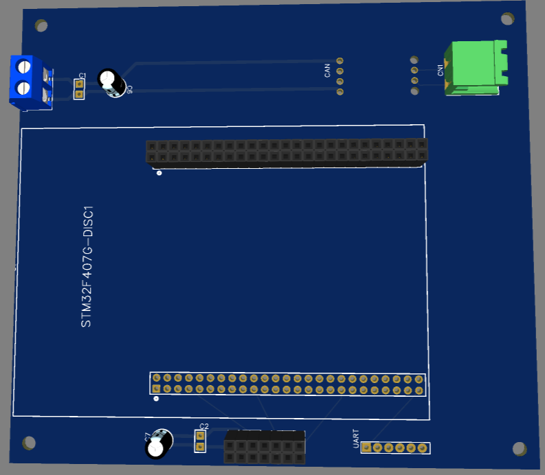

# Automotive CAN-Ethernet Gateway ECU

## 1. Overview
This project presents the design and implementation of an **Automotive Gateway ECU** prototype based on the modern **Zonal Architecture** trend. The gateway serves as a central router to exchange data and diagnostic services between a high-speed Ethernet backbone and real-time CAN bus networks.

**Key achievements:**
*   Implemented a 3-layered software architecture simulating automotive standards.
*   Developed a routing engine using **FreeRTOS** to handle concurrent network traffic.
*   Successfully translated **UDS (ISO 14229)** diagnostic requests from **DoIP** (Ethernet) to **DoCAN** and vice versa.

## 2. System Architecture

### Software Architecture
The embedded software is strictly structured into 3 layers to ensure modularity and hardware abstraction:
1.  **Application Layer:** Contains the `Gateway Core Task` (High Priority) for routing decisions and `UDS Diagnostic Service` handling.
2.  **Middleware Layer:** Integrates **FreeRTOS** for task scheduling/IPC (Queues, Mutex) and **LwIP Stack** for TCP/IP communication.
3.  **Driver Layer (MCAL):** Hardware abstraction using STM32 HAL for Ethernet MAC, CAN Controller, and Timers.

### Hardware Setup
*   **Gateway MCU:** STM32F407 Discovery (ARM Cortex-M4)
*   **Ethernet Interface:** LAN8720 PHY via RMII
*   **CAN Interface:** TJA1050 Transceiver (CAN 2.0B)
*   **CAN Nodes (Simulated ECUs):** STM32F103 ("Blue Pill") used as sensor nodes and traffic generators.

## 3. Core Functionalities

*   **CAN Protocol (ISO 11898):** Support for both Standard (11-bit) and Extended (29-bit) IDs with Hardware Acceptance Filtering to reduce CPU load.
*   **Message Routing:** Bi-directional data transfer between CAN and UDP/TCP sockets.
*   **UDS Diagnostic (ISO 14229):** 
    *   Translates DoIP requests (e.g., `Read Data By Identifier 0x22`) from a PC Client into DoCAN frames.
    *   Routes the frame to the specific target ECU on the CAN bus.
    *   Relays the ECU's response back to the PC Client via Ethernet.

## 4. Development Tools
*   **IDE:** Keil uVision (MDK-ARM) / STM32CubeMX
*   **Language:** Embedded C
*   **Testing & Validation:** Wireshark (Network analysis), MobaXterm, Logic Analyzer, Custom multi-node CAN testbench.

## 5. Performance Evaluation
*   Evaluated system latency (round-trip time) for UDS requests.
*   Measured maximum throughput (frames per second) under high network load generated by a dedicated CAN node.